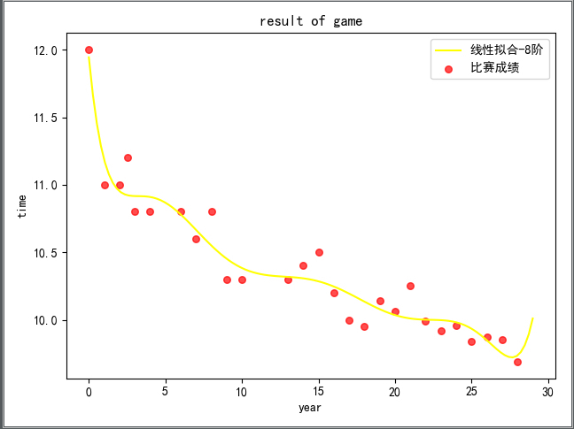
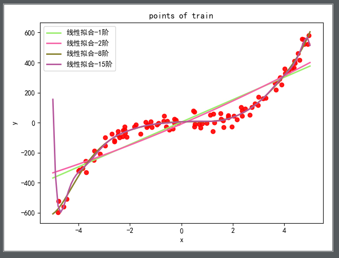
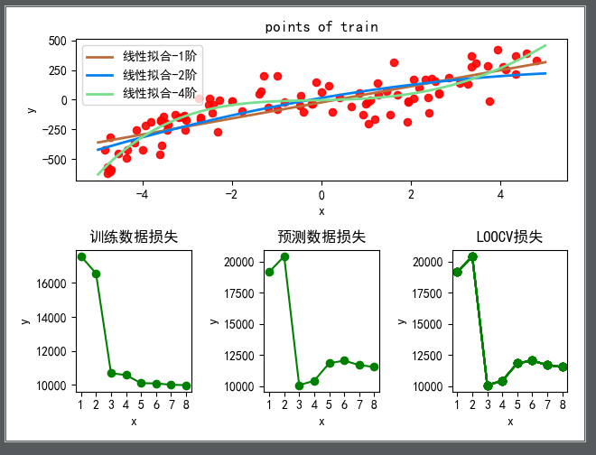

## 引言
早上上班的路上读《社会心理学》里面有一段话，觉得不错，摘在这里。

> **我们人类总是有一种不可抑制的冲动，想要解释行为，对其归因，以使其变得次序井然．具有可预见性，使一切尽在掌握之中。**你我对于类似的情境却可能表现出截然不同的反应，这是因为我们的想法不同。我们对朋友的责难做何反应，取决于我们对其所做的解释，取决于我们是把它归咎于朋友的敌意行为，还是归结于他糟糕的心情。
> 从某种角度来说，我们都是天生的科学家。我们解释着他人的行为，通常足够快也足够准确，以适应我们日常生活的需要。当他人的行为具有一致性而且与众不同时，我们会把其行为归因于他们的人格。例如。如果你发现一个人说话总是对人冷嘲热讽．你可能就会推断此人秉性不良，然后便设法尽量避免与他的接触。

当然这是指更大范围内的人类心理，在对数据和模型的痴迷上，人类的欲望显然也是强烈的，人类总是想尽一切的办法打破现有的桎梏，在创造了更多的不确定性之后，期望通过对数据的把控和预测以看到更确切的未来。

这次我们来从矩阵和向量的角度来解释最小二乘法及非线性的模拟建模。

## LS 的矩阵推导
继续使用上一次的方程式并将其改写成矩阵的形式如下：


$$
f(x_n;w_0,w_1) = w_0 + w_1x = w^Tx \tag{2.1}
$$

代入最小二乘损失函数，得到结果为：

$$
\begin{align}
\mathcal{L} &= \frac{1}{N} \sum_{n=1}^{N} \mathcal{L}_n(t_n,f(x_n;w_0,w_1 )) \\
&= \frac{1}{N} \sum_{n=1}^{N} (t_n-w^tx_n)^2 \tag{2.2} \\
& = \frac{1}{N} \sum_{n=1}^{N} (t-Xw)^T(t-Xw) \tag{2.3}
\end{align}
$$

式 2.2 到式 2.3 的证明忽略。

其中 $X$ 、$W$ 和 $T$ 为：

$$
 X = \begin{bmatrix} x_1^T  \\ x_2^T  \\ x_3^T   \\ \vdots \\  x_n^T  \\ \end{bmatrix} =  \begin{bmatrix} 1 & x_1  \\ 1 &  x_2 \\ 1 & x_3  \\ \vdots & \vdots\\ 1 & x_n  \\ \end{bmatrix} \\
 w = \begin{bmatrix} w_0^T  \\ w_1^T \end{bmatrix} \quad \\
 t = \begin{bmatrix} t_1^T  \\ t_2^T  \\ t_3^T   \\ \vdots \\  t_n^T  \\ \end{bmatrix}
$$

对上述 2.3 展开，得到下面的表达式：

$$
\begin{align}
\mathcal{L} &= \frac{1}{N} w^TX^TXw - \frac {2} {N}w^TX^Tt + \frac {1}{N} t^Tt \\
& = \frac{1}{N} (w^TX^TXw - 2 w^TX^Tt + t^Tt)
\end{align}
$$

为了得到最小值，需要得到 $\mathcal{L}$的拐点（极小值）一致的向量$w$的值，这里一样是求 $\mathcal{L}$ 关于 $w$ 的偏导数，并令其为 0，可以代入上述的矩阵进行求解，也可以使用一些恒等式来直接化简:

$$
% inner array of minimum values 内层"最小值"数组
\begin{array}{c|c}
\hline
f(w) & 
\frac {\partial f} {\partial w} \\
\hline
w^Tx & x \\
x^t=Tw & x \\
w^Tw & 2w \\
w^TCw & 2Cw \\
\hline
\end{array}
$$

得到的表达式如下：

$$
\frac {\partial \mathcal{L}} {\partial w} = \frac {2} {N} X^TXw - \frac {2} {N}X^Tt = 0 
$$

$$
X^Xw = X^Tt \tag{2.4}
$$

从而得到使损失最小的$w$值，$\hat w$ 的矩阵公式为：

$$
\hat w = (X^TX)^{-1}X^Tt \tag{2.5}
$$

根据此公式解出的值与上次用标量形式解出的是一样的。

## 线性模型的非线性响应

前面我们所假设的是拟合函数是一次函数，但是可以明显的看出拟合效果并不好，所以需要往更高次的多项式延伸，假如是二次的话，那么可以表示为：

$$
f(x;w) = w^Tx = w_0+w_1x+w_2x^2
$$

更一般的，扩展 $x$ 的幂次到任意任意阶的多项式函数，对于一个 K 阶多项式，可以扩展数据矩阵为：

$$
t = \begin{bmatrix} 
x_1^0 & x_1^1 & x_1^2 & \cdots & x_1^k \\ 
x_2^0 & x_2^1 & x_2^2 & \cdots & x_2^k\\ 
\vdots & \vdots & \vdots & \ddots & \vdots \\
x_n^0 & x_n^1 & x_n^2 & \cdots & x_n^k \\
\end{bmatrix}
$$

函数表达为更一般的形式：

$$
f(x;w)= \sum^K_{k=0} w_kx^k
$$

其解一样适用于式 $2.5$

可以求得其八阶线性拟合结果如下：



代入如下:

```
# -*- coding: utf-8 -*
import matplotlib.pyplot as plt
import matplotlib
import numpy as np

x_cord = []
y_cord = []
def drawScatterDiagram(fileName):
    fr=open(fileName)
    for line in fr.readlines():
        lineArr=line.split(',')
        x_cord.append(float(lineArr[0]))
        y_cord.append(float(lineArr[1]))
    # plt.scatter(x_cord,y_cord,s=30,c='red',marker='o', alpha=0.7,label='比赛成绩 ')
    # plt.xlabel("year")
    # plt.ylabel("time")
    # plt.title("result of game")

def noLinearMoreTimesCalculate():
    x_mat = np.ones((len(x_cord),1))
    y_mat = np.mat(y_cord).T
    test = np.array(x_cord)
    test = (test - 1896)/4.0  // 数据预处理，缩小化
    # x_mat = np.mat(np.c_[x_zeros,test])
    for index in range(1,9):
        x_temp = test**index
        x_mat = np.mat(np.c_[x_mat, x_temp])
    print(x_mat)
    w_mat = ((x_mat.T * x_mat).I*x_mat.T*y_mat)[::-1]
    w_mat = w_mat.T
    c = np.squeeze([i for i in w_mat])
    print(c)
    func = np.poly1d(c)
    x_mLo = np.linspace(0, 29, 112)

    y_mLo = func(x_mLo)

    plt.scatter(test,y_cord,s=30,c='red',marker='o', alpha=0.7,label='比赛成绩 ')
    plt.xlabel("year")
    plt.ylabel("time")
    plt.title("result of game")

    plt.plot(x_mLo,y_mLo, c="yellow",label='线性拟合-8阶')
    plt.legend(loc='upper right')

if __name__ == '__main__':
    drawScatterDiagram("olympic100m.txt")
    # linearCalculate()
    # noLinearCalculate()
    noLinearMoreTimesCalculate()
    plt.show()
```

## 过拟合与验证
从上次的一阶线性拟合到现在的八阶拟合，从直观上看，八阶的拟合效果比一阶的明显好很多，但是我们做拟合的根本目的是为了做预测，不是纯粹为了拟合而拟合，因为理论上说，一般 N 个数据点的拟合， N-1 阶的表达式可以完全拟合所有的数据点，但是这样子的拟合结果对于预测而言可能是极其差的。

那么如何衡量呢?
和拟合是一样的思想，看模型在泛化问题时候的表现，即是在预测验证数据上的表现，如果其损失很小，那么可以认为这个模型的预测能力不错。

### 验证数据
克服过拟合问题的一般方法是使用第二个数据集，即是验证集。用其来验证模型的预测性能，验证集可以是单独提供的，也可以从原始训练集中拿出来的。

从验证集计算的损失对于验证集数据的选择敏感，如果验证集非常小，那就更加困难了，而交叉验证是一个有效使用现有数据集的方法。

一般是 K 折交叉验证，当 K = N 的时候，及 K 恰好是等于数据集中的可观测数据的数量，每个观测数据依次拿出用作测试其他 N-1 个对象训练得到的模型，其又叫 留一交叉验证 （Leave-One-Out Cross Validation, LOOCV）,对于 LOOCV 的均方验证为：

$$
\mathcal{L}^{CV} = \frac {1}{N} \sum^N_{n=1}(t_n-\hat{w}^T_{-n}x_n)^2
$$

其中 $\hat{w}_{-n}$ 是除去第 n 个训练样例的参数估计值。

###代码实现





  


