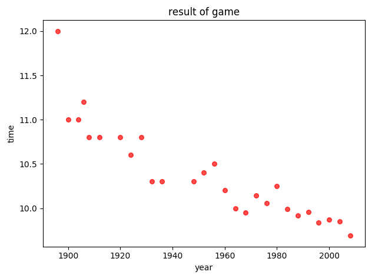

title: '最小二乘法的朴素实现'
date: 2018-06-21 20:23:21
tags: [机器学习]
category: [机器学习]
---

## 引言

最小二乘法（Least Squares Method, 简记为LSE）的维基解释。 

>最小二乘法（又称最小平方法）是一种数学优化技术。它通过最小化误差的平方和寻找数据的最佳函数匹配。利用最小二乘法可以简便地求得未知的数据，并使得这些求得的数据与实际数据之间误差的平方和为最小。 [^1]

 如果大学的时候学过高等数学，或许你对这个名词就不会陌生，这是下册第九章第十节的内容。

其表示法为

$$
\min\sum_in(y_m^{(i)}-y^{(i)})^2 
$$

其中 $y_m$ 表示我们拟合函数得到的拟合结果，$y_i$ 表示真实值。

&emsp; &emsp; “最小二乘法”是最优化问题中建立经验公式的一种实现方法。了解它的原理，对于了解后面“Logistic回归”和“支持向量机的学习”都很有裨益。

这次就是最小二乘法的朴素实现，即是不借助矩阵、向量等，纯粹借助数学推导完成。

## 起源背景

最小二乘法是在十九世界的产生的，源于天文学和测地学上的应用需要。

其中高斯使用的最小二乘法的方法发表于1809年他的著作《天体运动论》中，而法国科学家勒让德于1806年独立发现“最小二乘法”，但因不为时人所知而默默无闻。两人曾为谁最早创立最小二乘法原理发生争执。[^1]

1829年，高斯提供了最小二乘法的优化效果强于其他方法的证明，即高斯-马尔可夫定理。

## 使用及实现
### 问题引入
“最小二乘法”的核心就是保证所有数据偏差的平方和最小。

首先有这样一组看起来比较杂乱的数据，这组数据是 1896 到 2008 年间部分年份的男子百米赛跑最佳成绩，其散点图效果如下：



如何于混沌中找出规律，在杂乱中确定关系，往往是我们最关心的事情，那么对于上面这样一组数据，我们就尝试对它进行建模拟合。

最简单的拟合是线性建模的拟合，即假设存在最佳的线性关系 $y=f(x;w_0,w_1)=w_0+w_1x $  可以拟合这组数据。

### 什么是最好？
这里首先要解决的一个问题就是什么是“最佳”？或者如何衡量“最佳”？这里最佳显然是存在由一组$w_0,w_1$确定的直线，这条直线尽可能的与所有的数据点接近，那么衡量远近即距离的最佳方法显然使用平方差，则这里可以使用下面这样一个平方差函数表示( $x_n$ 是年份，$t_n$ 是比赛成绩)： 
$$
\mathcal{L}_n =(t_n-f(x_n;w_0,w_1))^2 
$$

这个表达式的值越小，则表示误差越小。

这里用下面的公式表示 N 年的平均损失，最小二乘损失函数
$$
\mathcal{L}= \frac{1}{N} \sum_{n=1}^{N} \mathcal{L}_n(t_n,f(x_n;w_0,w_1 )) 
$$

这个值显然越小越好，而其最小的关键是寻找到最合适的$w_0, w_1$，这个数学表达式为

$$
\mathop{\arg\;\min}\limits_{w_0. w_1} \frac{1}{N} \sum_{n=1}^{N} \mathcal{L}_n(t_n,f(x_n;w_0,w_1 ))
$$

此时将函数关系表示为
$$
f(x_n;w_0,w_1) = w_0 + w_1x
$$

代入最小二乘损失函数，得到结果为：

$$
\begin{align}
\mathcal{L} &= \frac{1}{N} \sum_{n=1}^{N} \mathcal{L}_n(t_n,f(x_n;w_0,w_1 )) \\
& = \frac{1}{N} \sum_{n=1}^{N}(w_1^2x_n^2 + 2w_1x_n(w_0-t_n)+w_0^2-2w_0t_n+t^2)
\end{align}
$$

在上述函数 $\mathcal {L}$ 的最小值点处，其关于 $w_0$ 和 $w_1$ 的偏导数一定是 0。因此，对上函数式求偏导，使其等于 0 并对 $w_0$ 和 $w_1$ 求解，可以得到最小值。

### 化简结果
关于 $w_0$ 和 $w_1$ 的表示式分别为
$$
\left\{ 
\begin{array}{c}
\hat{w_0} = \overline {t} - w_1\overline {x} \\ 
\hat{w_1} = \frac {\overline {xt} - \overline{x} \overline{t}} {\overline{x^2}-(\overline{x})^2} 
\end{array}
\right. 
$$

###代码实现 
有了上述的表达式，直接使用代码计算得出的结果如下：


代码实现如下：

```
# -*- coding: utf-8 -*
import matplotlib.pyplot as plt
import numpy as np

x_cord = []
y_cord = []
def drawScatterDiagram(fileName):
    fr=open(fileName)
    for line in fr.readlines():
        lineArr=line.split(',')
        x_cord.append(float(lineArr[0]))
        y_cord.append(float(lineArr[1]))
    plt.scatter(x_cord,y_cord,s=30,c='red',marker='o', alpha=0.7)
    plt.xlabel("year")
    plt.ylabel("time")
    plt.title("result of game")

def linearCalculate():
    x = np.array(x_cord)
    y = np.array(y_cord)
    x_mean = np.mean(x_cord)
    y_mean = np.mean(y_cord)
    xy_mean = np.mean(x*y)
    x_square_mean = np.mean(x**2)

    w1 = (xy_mean-x_mean*y_mean)/(x_square_mean-x_mean**2)
    w0 = y_mean - w1*x_mean
    xasix = np.linspace(1896, 2008, 112)
    yasix = w1 * xasix + w0
    plt.plot(xasix,yasix, label='linear line')
    plt.legend(loc='upper right')

if __name__ == '__main__':
    drawScatterDiagram("olympic100m.txt")
    linearCalculate()
    plt.show()
```

## Reference

[^1]: 维基百科[最小二乘法](https://zh.wikipedia.org/wiki/%E6%9C%80%E5%B0%8F%E4%BA%8C%E4%B9%98%E6%B3%95)

