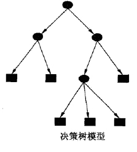
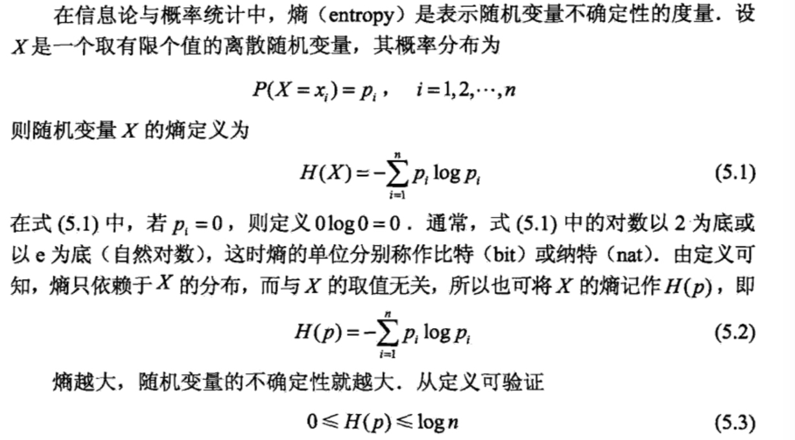
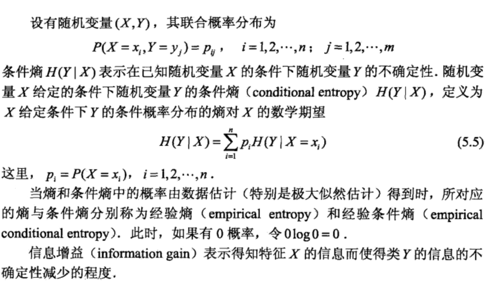

##引言
决策时是一种基本的分类和回归方法，现在主要讨论分类决策树。决策树模型呈树形结构，在分类问题中，表示基本特征对实例进行分类的过程，你可以认为他是一个 `if-then` 的集合，也可以认为是定义在特征空间与类空间上的条件概率分布。

其优点是模型具有可读性，分类速度快，学习时，利用训练数据，根据损失函数最小化的原则建立决策树模型。预测的时，对新的数据利用训练建立的决策树模型来分类。

决策树学习分为三个步骤：特征选择、决策树生成和决策树的剪枝。主要的决策树生成算法有 ID3 算法、C4.5 算法、 CART 算法。

本文的大纲如下：
1. 介绍决策树模型的基本概念
2. 决策树的特征选择和学习过程
3. 以 ID3 算法为例进行手写数字识别实践

## 决策树模型的基本概念
### 决策树模型
分类决策树是一种描述对实例进行分类的树形结构。决策树由节点和有向边组成，节点分为两类：内部结点和叶节点。内部结点表示一个特征或者属性，叶节点表示一个分类。

用决策树分类的过程类似于一系列的 `if-then` 判断，如下图的一个决策树，圆和方框分别表示内部节点和叶节点，决策分类过程是这样的：首先从顶端的根节点出发，每个内部结点都是一个特征判断，即是 `if-then`  判断，如果满足特征是一种路径，不满足特征是另一条路径。

### 决策树学习
决策树学习，假设给定训练数据集：
$$
D=\{(x_1,y_1),(x_2,y_2),\cdots,(x_N,y_N)\}
$$

其中，$x_i = (x_i^1,x_i^2,\cdots,x_i^n)$ 为输入实力（特征向量），n为特征个数， $y_i\in\{1,2,\cdots,K\}$为类标记，$i=1,2,\cdots,\N$，N 为样本容量。学习的目标是根据给定的训练数据集构建一个决策树模型，使他能够进行正确的分类。

而通过上面决策树的概念介绍，我们可以知道，决策树学习本质上是从训练数据集中归纳出一组分类规则。与训练数据集不相矛盾的决策树（即是能对训练数据进行正确分类的决策树）可能有多个，有可能一个都没有。我们需要的是一个与训练数据矛盾较小的决策树，同时有较好的泛化能力。

决策树学习的损失函数通常是正则化的极大似然函数。决策树学习的策略也自然是以损失函数为目标函数的最小化。而这是一个 NP 问题，所以一般采用启发式的方法求得一个次最优解。

决策树学习的算法通常是一个递归的选择最优特征，并根据该特征对训练数据进行分割，使得对各个子数据集有一个最好的分类的过程。

## 特征选择
特征选择在于选取对训练数据具有分类能力的特征，这样可以提高决策树学习的效率，而衡量特征分类效果的函数就是信息增益函数。

###信息增益
信息增益是信息论中的概念，了解信息增益，首先要了解熵和条件熵的定义。

信息增益的定义：特征 A 对训练集 D 对信息增益   g(D,A)，定义为集合 D 的经验熵 H(D) 与特征 A 给定的条件下 D 的经验条件熵 H(D|A) 之差，即是：
$$
g(D,A) = H(D)-H(D|A)
$$

