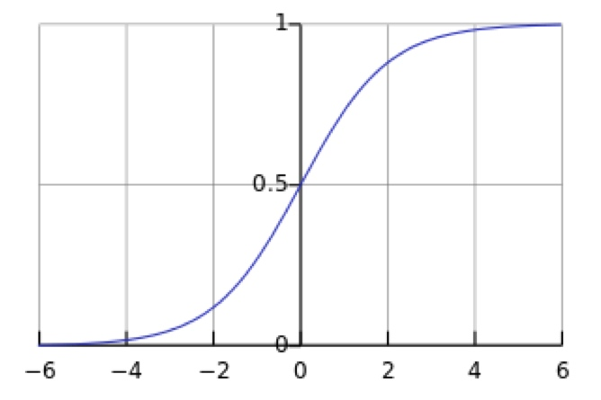
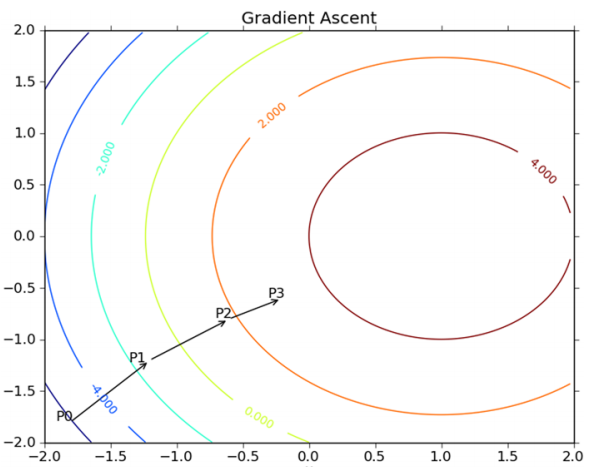
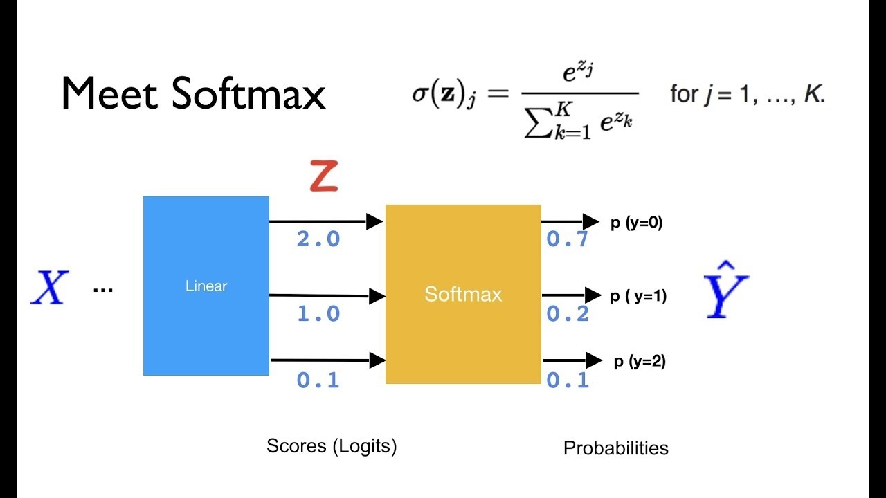
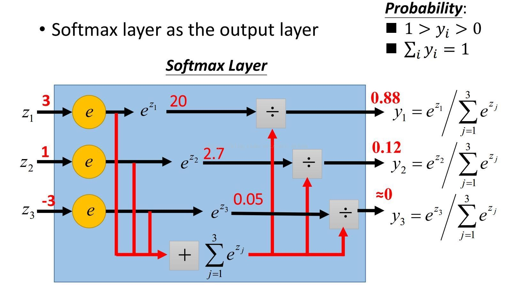
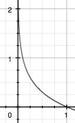

## 引言
逻辑斯谛回归（logistic regression）是统计学习中的经典分类算法。最大熵模型是概率模型学习的一个准则，将其推广到分类问题得到最大熵模型（maximum entropy model). 逻辑斯谛回归模型与最大熵模型都是对数线性模型.

## 逻辑斯谛回归模型
###sigmoid 函数
首先我们知道，线性回归的公式如下： 
$$
z = \omega_0x_0+\omega_1x_1+\omega_2x_1+\cdots+\omega_nx_n = \omega^Tx \tag{1}
$$

其次在介绍逻辑斯谛回归模型之前，我们先引入sigmoid函数，其数学形式是：
$$
g(x) = \frac {1}{1+e^{-x}} \tag{2}
$$

函数曲线如下:

从上图可以看到 sigmoid 函数是一个 s 形的曲线，它的取值在 [0, 1] 之间，在远离 0 的地方函数的值会很快接近 0/1 。在横坐标的大尺度下看，sigmoid 函数很类似阶跃函数。

## 二项逻辑斯谛回归模型
一个机器学习的模型，实际上是把决策函数限定在某一组条件下，这组限定条件就决定了模型的假设空间。当然，我们还希望这组限定条件简单而合理。而逻辑回归模型所做的假设是：

$$
h_\omega(x)=\frac {1}{1+e^{-z}} = \frac {1}{1+e^{-\omega^T\cdot x}} \tag{3}
$$

其中，
$$
y = \frac {1}{1+e^{-x}}
$$

我们可以看到，Logistic Regression 算法是将线性函数的结果映射到了sigmoid函数中。

因此，为了实现 Logistic 回归分类器，我们可以在每个特征上都乘以一个回归系数（如公式1所示），然后把所有结果值相加，将这个总和代入 Sigmoid 函数中，进而得到一个范围在 0~1 之间的数值。任何大于 0.5 的数据被分入 1 类，小于 0.5 即被归入 0 类。所以，Logistic 回归也是一种概率估计，比如这里Sigmoid 函数得出的值为0.5，可以理解为给定数据和参数，数据被分入 1 类的概率为0.5。

模型的条件概率分布函数的一般写法如下
$$
P(Y=1\mid x;\omega) = h_\omega(x) \tag{4}
$$
及
$$
P(Y=0 \mid x;\omega) = 1-h_\omega(x) \tag{5}
$$

其中 $w = (w^1,w^2, \cdots, w^n, b)^T$ 为权值向量, $x=(x^1, x^2, \cdots, x^n, 1)^T$ 为输入向量.

因此逻辑斯谛回归的对数几率为
$$
log \frac {P(Y=1\mid x)}{1-P(Y=1\mid x)} = w \cdot x \tag{6}
$$

由此可知, 在二项逻辑斯谛回归模型中, 输出 Y=1 的对数几率是输入 x 的线性函数.
 又由式(3)可知,线性函数的值越接近正无穷, 概率值就越接近1, 反之越接近0, 这样子的模型就是逻辑斯谛回归模型.
 
###参数求解之最大似然估计法
模型的数学形式确定后，剩下就是如何去求解模型中的参数。统计学中常用的一种方法是最大似然估计，即找到一组参数，使得在这组参数下，我们的数据的似然度（概率）越大.

首先通过式(4)及(5)确定的概率函数为：
$$
P(y\mid x;\omega) = (h_\omega(x))^y\cdot (1-h_\omega(x))^{1-y}
$$

因为样本数据相互独立，所以他们的联合分布可以表示为各边际分布的乘积，取似然函数为：
$$
\begin{align}
L(\omega) &= \prod_{i=1}^n P(y^i \mid x^i; \omega) \\
& = \prod_{i=1}^n (h_\omega(x^i))^{y^i}\cdot (1-h_\omega(x^i))^{1-y^i}
\end{align}
$$

取对数似然函数：
$$
l(\omega)= \log(L(\omega)) = \sum_{i=1}^m\log((h_\omega(x^i))^{y^i})+\log((1-h_\omega(x^i))^{1-y^i})
$$
 
最大似然估计就是要求使得$l(\omega)$取最大值时候的$\omega$，这里可以用显然可以用梯度上升法求解，同时，如果稍微做下变换：
$$
J(\omega) = - \frac{1}{n}l(\omega)
$$

因为乘了一个负的系数,然后就可以使用梯度下降算法进行求解了.

###梯度上升算法
梯度上升算法的基本思想是:要找到某个函数的最大值, 最好的方法是沿着该函数的梯度方向探寻. 如果梯度记为 $\nabla$, 那么函数 $f(x,y)$的梯度表示为:
$$
\nabla f(x,y) = \begin{pmatrix}  \frac{\partial f(x,y)}{\partial x} \\
\frac{\partial f(x,y)}{\partial y} \end{pmatrix} 
$$

梯度上升算法的描述公式为:
$$
w:=w+\alpha \nabla f(w)
$$

梯度下降算法的描述公式:
$$
w:=w-\alpha \nabla f(w)
$$

这个梯度意味着要沿 x 的方向移动 $\frac{\partial f(x,y)}{\partial x}$ ，沿 y 的方向移动 $\frac{\partial f(x,y)}{\partial y}$ 。其中，函数$f(x, y)$必须要在待计算的点上有定义并且可微。

梯度上升的一个示意图

步长，记作 α , $\nabla f(w)$ 表示沿着梯度变化的方向

这个算法将会在很大的程度上被初始点的选择影响而陷入局部最小点。

### 简单的线性分类器

代码示例

## 多项逻辑斯谛回归模型
上述的都是二分类问题, 那么如何改造 logistics 回归解决多分类问题呢?

第一种方式是直接根据每个类别，都建立一个二分类器，带有这个类别的样本标记为1，带有其他类别的样本标记为0。假如我们有 K 个类别，最后我们就得到了 K 个针对不同标记的普通的logistic分类器。

第二种方式是修改 logistic 回归的损失函数，让其适应多分类问题。这个损失函数不再笼统地只考虑二分类非1就0的损失，而是具体考虑每个样本标记的损失。这种方法叫做 softmax 回归，即 logistic 回归的多分类版本。

首先对于第一种方式, 假如给定的的数据集 $X \in R^{m\times n}$, 他们的标记为 $Y \in R^k$, 即是政协样本有 K 个不同的类别。

现在我们挑选出数据集中标记为 $c(c\leq k)$ 的样本，将挑选出来的样本标记为1， 其余的所有不为 c 的样本标记为0，由此训练出一个 logistics回归二分分类器， 即得到 $h_c(x)$ （表示针对标记为 c 的 logistics 分类函数）

按照上面的步骤， 我们可以得到k个不同的分类器。针对一个分类样本，我们需要找到这个k个分类函数中输出值最大的那个， 即认为是测试样本的输出标记：
$$
\mathop{\arg\;\max}\limits_{c} h_c(x), c=1,2,\cdots,k
$$

第二种方式是 softmax 回归

$$
h_\theta(x^i) = 
\begin{bmatrix} 
p(y^i = 1 \mid x^i; \theta) 
\\ p(y^i = 2 \mid x^i; \theta) \\ 
\vdots \\
p(y^i = k \mid x^i; \theta)
\end{bmatrix} = \frac{1}{\sum_{c=1}^k e^{\theta_c^Tx^i}} 
\begin{bmatrix}
e^{\theta_1^Tx^i} \\
e^{\theta_2^Tx^i} \\
\vdots \\
e^{\theta_k^Tx^i}
\end{bmatrix}
$$

然后使用矩阵$\theta$表示上式中的$\theta_1,\cdots,\theta_k$,即是:
$$
\theta = \begin{bmatrix}
\theta_1^T \\
\theta_2^T \\
\vdots \\
\theta_k^T \\
\end{bmatrix}
$$

Softmax回归中将 $\textstyle x$ 分类为类别 $\textstyle j$ 的概率:
$$p(y^i=j\mid x^i;\theta) = \frac{e^{\theta_j^T}x^i}{\sum_{l=1}^k e_l^Tx^i}$$

一个图解:

### 损失函数

为了训练模型，我们需要定义一个 loss function 来描述模型对问题的分类精度。loss 越小，代表模型的分类结果与真实值的偏差越小。在多分类问题中常使用交差熵作为损失函数，交叉熵定义如下，其中y代表真实值， $\tilde{y}$ 代表预测值，n代表需要区分的类别数。

$$
H_y(\tilde{y}) = - \sum_i^n y\log \tilde{y}
$$

那么，为什么交叉熵可以用来判断模型对真实概率分布 估计的准确程度呢？首先补充几个知识点

1. **信息量**
直觉上来说：一件事情发生的可能性越小（概率小），当这件事发生时，人们所获得信息量越大；相反，一件事极有可能发生（概率大），当这件事发生时，人们会感觉没有什么信息量，因为早知道会发生。因此信息量跟事件发生的概率有关。定义如下，其中 $p(x_{0})$ 为事件 $x_{0}$ 发生的概率，log 为自然对数。

$$
I(x_0) = -log(p(x_0))
$$

由于是概率所以 $p(x_{0})$  的取值范围是 [0,1],绘制为图，可见该函数符合我们对信息量的直觉

2. 熵
对于某个事件，有n种可能性，每种可能性有个概率值。熵用来表示所有信息量的期望, 也是随机变量不确定性的度量, 其定义如下:
$$
H(X) = - \sum_i^n p(x_i)\log (p(x_i))
$$

由此可见, 熵只依赖与 X 的分布,与其取值大小无关,因此熵也可以直接记做:
$$
H(p) = - \sum_i^n p_i\log p_i
$$

熵越大, 随机变量的不确定性越大.

3. 相对熵（KL散度）
对同一个问题，用P、Q同时描述，用 KL 散度来衡量两个分布的差异。
$$
D_{KL}(p||q)=\sum_{i}^{n}{}p(x_{i})log(\frac{p(x_{i})}{q(x_{i})})\\
$$
在机器学习中，P往往用来表示真实的样本分布，比如[1,0,0]表示当前样本属于第一类。Q用来表示模型所预测的分布，比如[0.7,0.2,0.1]。当然Q越接近P越好，这样就说明预测值十分逼近真实值。也就是上式的 D_{KL}的值越小越好。

4. 交差熵

对 $D_{KL}(p||q)$公式进行变形：

$$
\begin{align}
D_{KL}(p||q) &= \sum_{i}^{n}{p(x_{i})log(p(x_{i}))} - \sum_{i}^{n}{p(x_{i})log(q(x_{i}))} \\
& = -H(p(x)) + [-\sum_{i}^{n}{p(x_{i})log(q(x_{i}))}]
\end{align}
$$

等式的前一部分恰巧就是p的熵，等式的后一部分，就是交叉熵：

$$
H(p,q) = - \sum_{i}^{n}{p(x_{i})log(q(x_{i}))}
$$

在机器学习中，我们需要评估 labels 和 predicts 之间的差距，使用 KL 散度刚刚好，即 $D_{KL}(y||\tilde{y})$ ，由于KL散度中的前一部分−H(y)不变，故在优化过程中，只需要关注交叉熵就可以了。所以一般在机器学习中直接用用交叉熵做loss，评估模型。

### 识别数字实践

